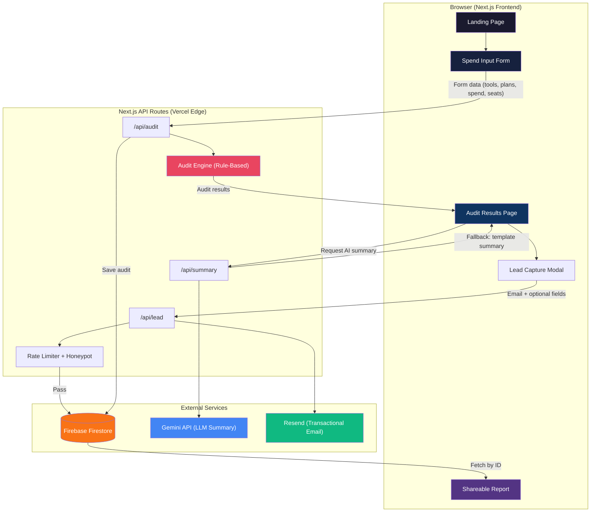
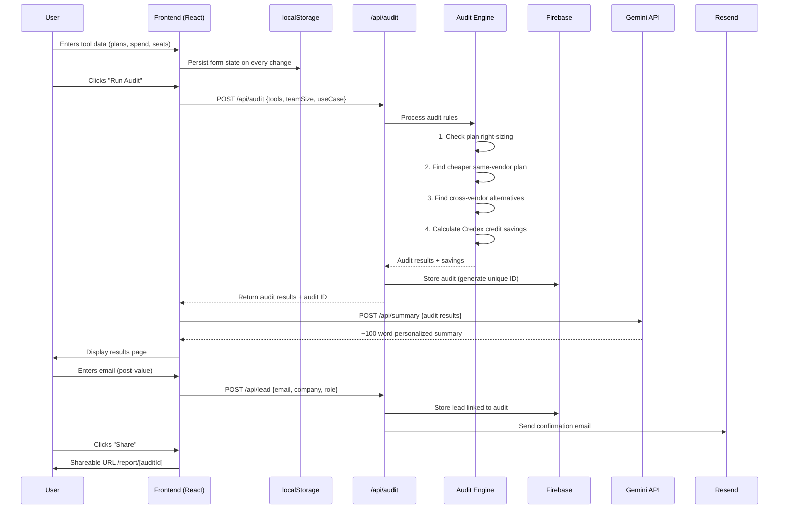

# CostPilot — Architecture

## System Diagram



## Data Flow: Input → Audit Result



## Why This Stack

### Next.js 14 (App Router) + TypeScript
- **Server Components** reduce client-side JavaScript for faster LCP
- **API Routes** eliminate need for a separate backend server
- **Dynamic OG images** via `next/og` for shareable URLs — no external service needed
- **File-based routing** maps naturally to our pages: `/`, `/audit`, `/results`, `/report/[id]`
- **TypeScript** catches pricing calculation bugs at compile time — critical for financial logic

### Firebase (Firestore)
- **Document model** fits our data shape naturally: each audit is a self-contained document
- **Free tier** (Spark): 1 GiB storage, 50K reads/day, 20K writes/day — plenty for this stage
- **No server to manage** — scales automatically
- **Security Rules** protect data without a custom auth layer

### Tailwind CSS + shadcn/ui
- **Rapid UI development** with consistent design tokens
- **shadcn/ui** gives us accessible, customizable primitives we own (not an npm dependency)
- **JIT compilation** means zero unused CSS in production
- **Built-in dark mode** support via class strategy

### Gemini API
- **Used only for the personalized summary** — NOT for audit logic
- **Generous free tier** for development and testing
- **Graceful fallback** to a template-based summary if API fails

### Resend
- **100 emails/day free** — sufficient for MVP
- **React Email** support for beautiful transactional emails
- **Simple API** — one POST request to send

### Vercel
- **Native Next.js support** — zero configuration deployment
- **Edge Functions** for API routes — low latency globally
- **Preview deployments** on every PR for testing
- **Free tier** covers our expected traffic

## Database Schema (Firestore)

```
audits/
  {auditId}/
    id: string (nanoid)
    createdAt: timestamp
    tools: [{
      name: string
      plan: string
      monthlySpend: number
      seats: number
    }]
    teamSize: number
    useCase: "coding" | "writing" | "data" | "research" | "mixed"
    results: {
      totalMonthlySavings: number
      totalAnnualSavings: number
      recommendations: [{
        tool: string
        currentPlan: string
        currentSpend: number
        recommendedAction: string
        newSpend: number
        savings: number
        reason: string
      }]
    }
    aiSummary: string | null
    isPublic: boolean (default: true)

leads/
  {leadId}/
    auditId: string (ref to audit)
    email: string
    companyName: string | null
    role: string | null
    teamSize: number | null
    savingsAmount: number
    createdAt: timestamp
    emailSent: boolean
```

## What I'd Change for 10,000 Audits/Day

| Concern | Current | At Scale |
|---------|---------|----------|
| **Database** | Firestore (document reads) | PostgreSQL (Supabase/Neon) with connection pooling — better for aggregate queries and analytics |
| **Caching** | None | Redis cache for pricing data + recent audit results. CDN caching for public report pages |
| **Rate Limiting** | In-memory + honeypot | Upstash Redis rate limiter with sliding window, per-IP and per-session |
| **LLM Calls** | Direct Gemini API per request | Queue-based processing with Bull/BullMQ. Batch summaries. Cache identical audit profiles |
| **Email** | Resend per-request | SES with SQS queue for async delivery. Batch digest emails |
| **OG Images** | Dynamic generation per request | Pre-generate and cache in Cloudflare R2/S3 |
| **Monitoring** | Console logs | Sentry for errors, PostHog for analytics, Datadog for infrastructure |
| **Search** | Firestore queries | Elasticsearch for audit lookup, full-text search on reports |
| **CDN** | Vercel Edge | Cloudflare in front for DDoS protection and global caching |
| **API** | Next.js API routes | Separate Node.js/Fastify microservice for audit engine, horizontally scaled |
